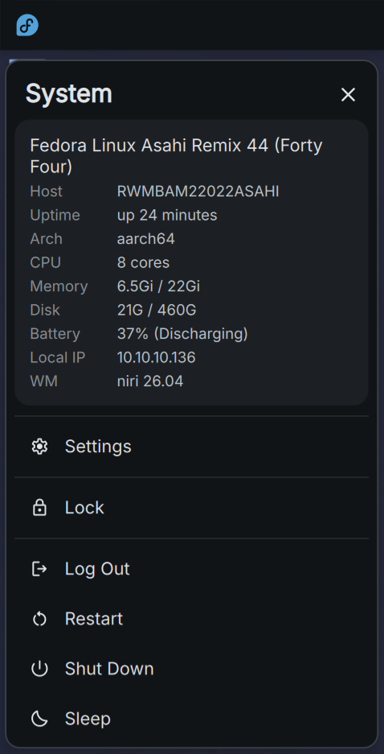

# Distro Menu

A [DankMaterialShell](https://github.com/AvengeMedia/DankMaterialShell) dankbar
widget that shows the **distro logo** far-left on the bar and, on click, opens a
dropdown modeled after the macOS **Apple menu** — a single anchored entry point
for system-level actions.



## Prerequisites

- **DankMaterialShell `>= 1.4.0`** — the shell that loads this plugin.
- **The `dgop` binary** (ships with DMS) — powers the About facts.

## Bar

The distro logo, auto-detected from `/etc/os-release` via DMS's shared
`SystemLogo` widget (nerd-font glyph for Fedora, Arch, and the other distros it
supports). No configuration.

## Dropdown

Grouped like the Apple menu, separators between clusters:

- **About this system** — a configurable set of facts (see Settings below).
  Read on demand (`dgop`, `uptime -p`, and a few cheap shell reads) each time the
  dropdown opens, so the plugin carries no `DgopService` ref lifecycle.
- **Settings** — opens DMS settings (`dms ipc call settings open`).
- **Lock** — locks the session (`dms ipc call lock lock`).
- **Log Out / Restart / Shut Down / Sleep** — power actions via DMS's
  `SessionService`. These **fire directly** with no confirmation prompt.

## Settings

Settings → Plugin Management → Distro Menu. One toggle per About field:

- **On by default:** Distro name (card heading), Kernel, Host, Uptime.
- **Off by default:** Architecture, CPU, Memory, Disk, Battery, Local IP, Shell,
  Window manager.

Toggles persist to `~/.config/DankMaterialShell/plugin_settings.json` and the
dropdown reflects them live.

## Install

DMS loads plugins from `~/.config/DankMaterialShell/plugins/`. Either clone this
repo directly into that directory:

```sh
git clone git@github.com:robwilkerson/dms-distro-menu.git \
  ~/.config/DankMaterialShell/plugins/distroMenu
```

or clone it anywhere and symlink it in:

```sh
git clone git@github.com:robwilkerson/dms-distro-menu.git
ln -s "$(pwd)/dms-distro-menu" \
  ~/.config/DankMaterialShell/plugins/distroMenu
```

Then enable it on the bar via Settings → Plugin Management, or add
`{"id":"distroMenu","enabled":true}` to a bar's widget list in `settings.json`.

## Uninstall

Remove it from the bar in Settings → Plugin Management (or delete its entry from
the bar's widget list in `settings.json`), then delete the plugin directory:

```sh
rm -rf ~/.config/DankMaterialShell/plugins/distroMenu
```

## Notes

- The power entries call `SessionService.logout/reboot/poweroff/suspend`
  in-process. To route them through DMS's confirm/countdown menu instead, swap
  the actions for `Quickshell.execDetached(["dms", "ipc", "call", "powermenu", "open"])`.

## License

MIT — see `LICENSE`.
